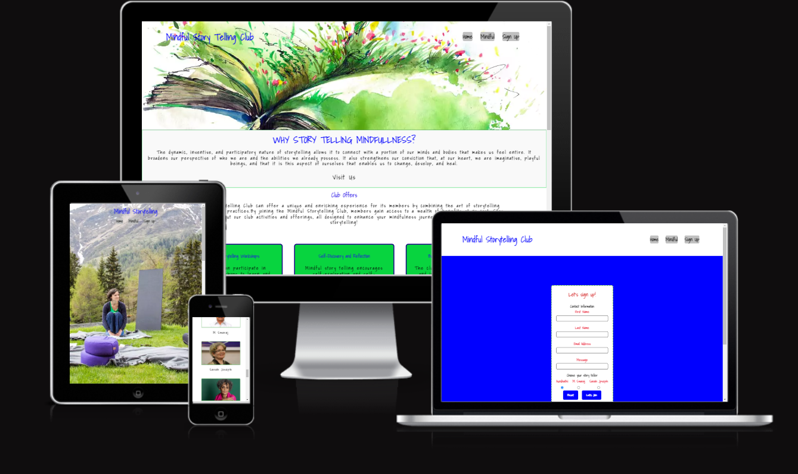
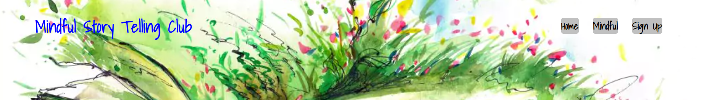
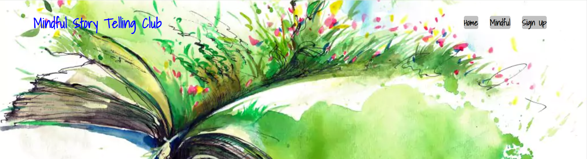
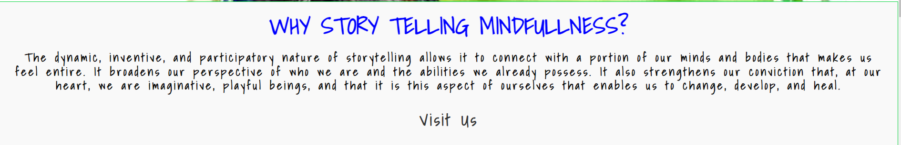
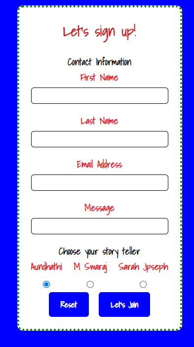
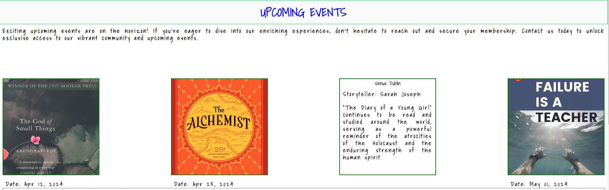
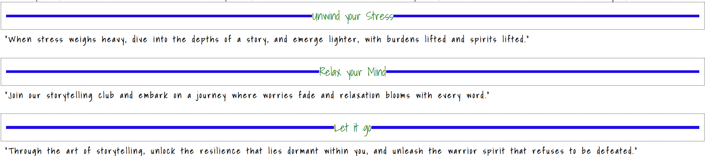

# Mindful Story Telling Club
## Project Portfolio 1 of Diploma in Full Stack Software Development at Code Institute

[visit the live site](https://ci-sumi.github.io/mindful-story-telling-club/)

## Table of Contents
1.  [Site Info](#site-info)
2.  [UX](#ux)
    2.1 [Ideal User Demographic](#ideal-user-demographic)
    2.2 [User Stories](#user-stories)
    2.3 [Development Planes](#development-planes)
    2.4 [Design](#design)
3. [Features](#features)
    3.1 [Existing Features](#existing-features)
    3.2 [Features to Implement](#features-to-implement)
4. [Technologies Used](#technologies-used)
    4.1 [Main Languages Used](#main-languages-used)
    4.2 [Frameworks, Libraries & Programs Used] (#frameworks,-libraries-&-programs-used)
5. [Deployment](#deployment)
6. [Issues and Bugs](#issues-and-bugs)
7. [Testing](#testing)
   7.1 [User Stories Testing](#user-stories-testing)
   7.2 [Manual Testing](#manual-testing)
   7.3 [Validator Testing](#validator-testing)
   7.4 [Lighthouse Testing](#lighthouse-testing)
   7.5 [Browser Validation](#browser-validation)
   7.6 [User Testing](#user-testing)
8. [Credits](#credits)
9. 8.1 [Content](#content)
   8.2 [Code Features](#code-features)
   8.3 [Media](#media)
10. [Acknowledgements](#acknowledgements)

 ## Site Info

The club aims to create a warm and inclusive environment where individuals from diverse backgrounds feel welcome and valued. This sense of belonging fosters connections and encourages members to participate actively in club activities.

The club features permanent storytellers who are experienced and skilled in the art of storytelling. These storytellers curate and present famous stories and books to the club members during regular sessions, captivating audiences with their engaging performances.

In addition to listening to famous stories, club members have the opportunity to share their own personal stories during designated sessions. This sharing of personal experiences allows members to express themselves authentically, connect with others on a deeper level, and find support and understanding within the community.

The club aims to uplift and inspire its members by providing a supportive space where individuals can share their triumphs, challenges, and reflections. Through storytelling and active listening, members offer empathy, encouragement, and solidarity, fostering a culture of positivity and mutual support.

Mindfulness techniques are integrated into club activities to promote relaxation, self-awareness, and emotional well-being. By practicing mindfulness during storytelling sessions and discussions, members learn to cultivate presence, compassion, and resilience in their daily lives.

  [Back to top⬆️](#mindful-story-telling-club)

  ## UX

  ### Ideal User Demographic
  The Ideal User for this website is:
  * The ideal user might range from young adults to   older individuals
  * Ideal user is likely to have an interest in storytelling, literature, mindfulness practices, and self-improvement. 
  * The ideal user may already have an interest in mindfulness or be open to exploring mindfulness techniques as a way to reduce stress, improve mental health, and enhance overall well-being.
  *  Ideal user values connection and community.
  * Ideal user enjoys storytelling in various forms, including reading books, listening to podcasts, attending storytelling events, and sharing their own stories.
  * Ideal user is interested in personal growth and self-reflection

  ### User Stories
  #### Current User Goals
  As a Current User:
  1. I want to browse and discover upcoming storytelling sessions and events so that I can plan my attendance accordingly.
  2. I want to share my personal stories during designated storytelling sessions so that I can connect with others and contribute to the club's community.
  3. I want to participate in mindfulness workshops and activities offered by the club so that I can learn new techniques for relaxation and self-awareness.
  4. I want to engage in discussions and socialize with other members through the club's online forum or community platform so that I can connect with like-minded individuals and foster relationships.
  5. The Home page has General information about the club.
  6. The mindful page has upcoming event list which user can keep track of it.
  7. The navigation bar is a common feature across all pages of the Mindful Storytelling Club website, providing easy access to each section of the site.

  #### As a visitor Goals
  1. I want to learn about the club's mission, values, and featured storytellers so that I can understand what the club offers and decide if it aligns with my interests.
  2. I expect to find a clear and user-friendly navigation system that guides me seamlessly through the different sections of the site. 
  3. When visiting the Mindful Storytelling Club website for the first time, I expect to be greeted by visually appealing and relevant imagery that enhances my overall browsing experience.
  * The images related to content were sourced from Wikipedia [Wikipedia](https://www.wikipedia.org/), while other images were obtained from Pexels and Unsplash.[Pexels](https://www.pexels.com/) and [Unsplash](https://unsplash.com/).
  * color palate from [coolors] https://coolors.co/f5fbef-92ad94-748b75-503d42-84c318;

  4. As visitor if you are interested,you can Contact Us section that leads to the last Contact Page with a form to contact the club for mindfulness.
#### Goal of someone experiencing stress, whether personal or professional
 1. Seeking Relaxation and Stress Relief: They may be looking for stories that can help them relax and unwind, providing a mental escape from their stressors. Engaging in mindfulness practices through storytelling could offer them a moment of peace and tranquility.
 2. Finding Inspiration and Hope: Individuals experiencing stress may seek stories that inspire them or offer hope during difficult times. They might be looking for narratives of resilience, overcoming challenges, or personal growth that resonate with their own struggles.
 3. Seeking Connection and Support: Sometimes, people turn to storytelling communities for a sense of belonging and understanding. They may want to connect with others who are experiencing similar stressors or find comfort in knowing they're not alone in their struggles.
 ### Development Planes
 Developing a website for a mindful storytelling club aimed at helping individuals dealing with stress requires careful planning and consideration.
#### Strategy
Target Audience Segmentation:
Current Members:

Exclusive access to storytelling resources, events, and workshops.
Regular updates on upcoming storytelling sessions and club activities.
Potential Members:

Compelling storytelling samples and club benefits to encourage membership.
Clear CTAs for joining the club or attending introductory events.
Individuals Interested in Mindfulness and Storytelling:

Resources on incorporating mindfulness practices into storytelling.
Inspirational stories highlighting the power of mindfulness in daily life.
 
 **Demographic and Psychographic Considerations:**

All Ages:

Diverse range of storytelling content suitable for all age groups.
Opportunities for intergenerational storytelling exchanges.
Professionals Seeking Creative Outlets:

Workshops and networking events tailored for professionals interested in storytelling as a creative outlet.
Integration with professional development themes such as communication and empathy.
People Seeking Emotional Connection and Self-Reflection:

Story prompts and guided reflection exercises for personal growth.
Platform for sharing personal stories and experiences in a supportive environment.

#### Scope
The Mindful Storytelling Club aims to create an engaging online platform that fosters a community of storytelling enthusiasts, promotes mindfulness practices, and facilitates personal growth through storytelling.

#### Content Strategy:
  * Identify the types of stories that will be most beneficial for your audience. These could include personal anecdotes, fictional narratives, guided meditations, etc.
 * Plan a content calendar to ensure a consistent flow of new stories and resources.
#### Functional Requirements:
User Functionality:

 * Storytelling Resources:

   * Accessible sections for storytelling inspiration, techniques, and resources.
   * Contact club for mindful story telling experience.

#### Structure
The information above was then organized in a hierarchical tree structure, a site map, showing how users can navigate through the site with ease and efficiency, with the following results:

  
Site Structure

  

#### Skeleton
Wireframes were made as presentation of the site pages while keeping a positive user experience in mind. They were created using an desktop version of Balsamiq.

  
Balsamiq Wireframes

  

   

[Back to top⬆️](#mindful-story-telling-club)

## Features 
### Existing Features
* **Navigation Bar**

  * Featured on all three pages, the full responsive navigation bar includes the name of club and links to the Home page, mindful events and Sign Up page and is identical in each page to allow for easy navigation.
  * On hover a small animation of transition appears, a colorful underline appears when mouse hover
  * On smaller screens the logo goes up in the center above the links.

  
  

    
Screenshot

    
    <!-- 
     -->
  

  

* **The landing page image**

  * The landing includes a photograph with text overlay to allow the user to see the name of the club.
  

  
  

    
Screenshot

    
    
  

* **Short Info Section**

  * This section allows the user to grasp the general info about the mindful story club.
  
  
  

    
Screenshot

    
  

  * **Club Offers**
  * This section allows the user to know the club goals.
   

    
Screenshot

    
  

   

* **Contact Section**
  * The Contact page to which the Contact Us button is leading on click. 
  * There's an encouraging message 

  

    
Screenshot

    
    

  

* **The Footer** 

  * The footer section includes links to the relevant social media sites of the Institute (actually leading only to the hompegaes of the respective social media sites). The links will open to a new tab to allow easy navigation for the user. 
  * The footer is valuable to the user as it encourages them to keep connected via social media.
  * The FontAwesome icons are used on smaller and middle screens, whilst the text appears on bigger screens.
  * There's a copyright info under the links.
  
  

    
Screenshots

    
   
  

  
* **Mindful**

  * This page main section provides upcoming events of club and its details
  * Also provides inspirational quotes
  
  
  

    
Screenshot

      
    
    
    
  

*  **Storytellers**
 * include images of story tellers
  

    
Screenshot

      
    
  

* **Testimonials**

  * The memmbers rating on club and their review. 
  

    
Screenshot

      
    
    
  

  

 
### Features to Implement
## Future Features

### Contact Details and Location

One of the upcoming features planned for implementation is the addition of contact details and the location of the club on each page. This will provide users with easy access to contact information and help them locate the club's physical address.

#### Implementation Plan:

- **Contact Details:** Include a section in the header or footer of each page displaying essential contact information such as email, phone number.

- **Location Information:** Integrate a map widget or provide textual information about the club's location, including address details and directions.

These additions will enhance user experience and facilitate better communication between the club and its members or visitors.

## Deployment
  * Navigate to the Settings tab in the GitHub repository.
  * From the left side menu, select **Pages**.
  * In the source section drop-down menu, choose the main branch and click **Save**.
  * Once the **main** branch is selected and saved, the page will automatically refresh, displaying a detailed ribbon to indicate the successful deployment.
  You can access the live link here: https://ci-sumi.github.io/mindful-story-telling-club/

  ### Local Deployment
   * To create a local copy of this project, you can clone it. In your Integrated Development Environment (IDE) Terminal, use the following command to clone the repository:
    **git clone https://github.com/ci-sumi/mindful-story-telling-club.git**

    

## Future Improvements
  * Add custom 404 page
  * I acknowledge that some of the commit messages may not meet the desired standards in terms of clarity and quality. I am committed to improving the quality of my commit messages in the future.
  * Fully functional contact form.

## Testing
  * HTML
  * No errors were returned when passing through the official  [W3C Markup Validator] (https://validator.w3.org/nu/?doc=https%3A%2F%2Fci-sumi.github.io%2Fmindful-story-telling-club%2Findex.html)

  * CSS
  * No errors were returned when passing through the official  [W3C CSS Validator Results] (https://jigsaw.w3.org/css-validator/validator?uri=https%3A%2F%2Fci-sumi.github.io%2Fmindful-story-telling-club&profile=css3svg&usermedium=all&warning=1&vextwarning=&lang=en)

 
## Acknowledgements
  * I extend a special thanks to my mentors, Aleksei Konovalov and Antonio Rodriguez, for their patient and insightful guidance throughout the project.
  * A heartfelt thank you to Tomislav, a Code Institute Alumni, for his valuable support and encouragement.
  * I am grateful to my friends who assisted in testing the project and providing valuable feedback.
  

[Back to top⬆️](#mindful-story-telling-club)

      

